# tailershop

mini uniform sell app with admin app with custom media sharing system
 
 for indian client `from fiver`
 `1 day delivery`

## flutter sdk setup: 3.27.1

## demo

  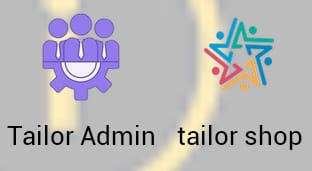
   
  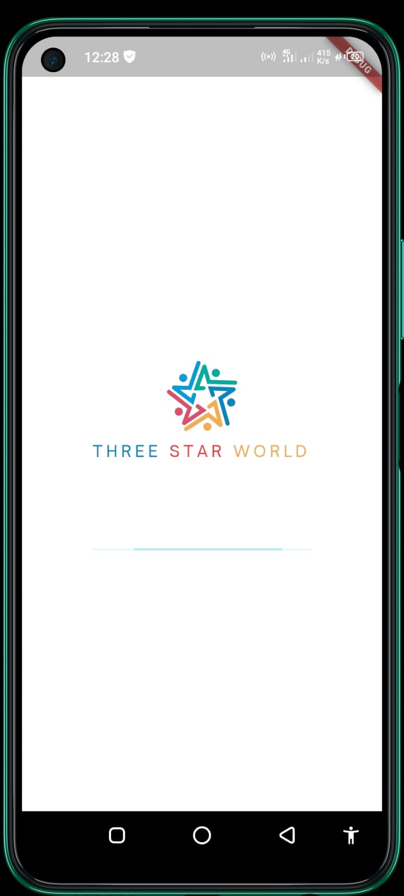
  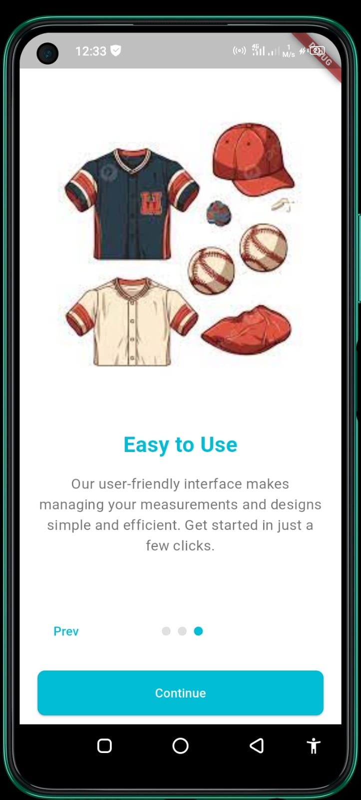
  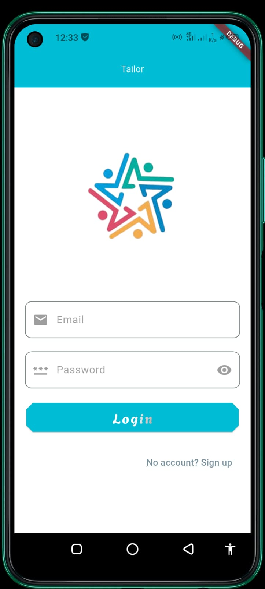
  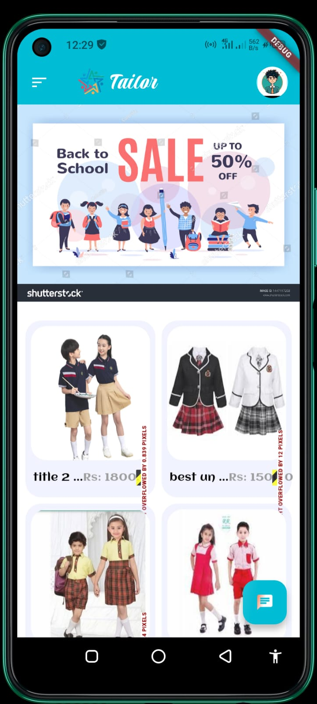
  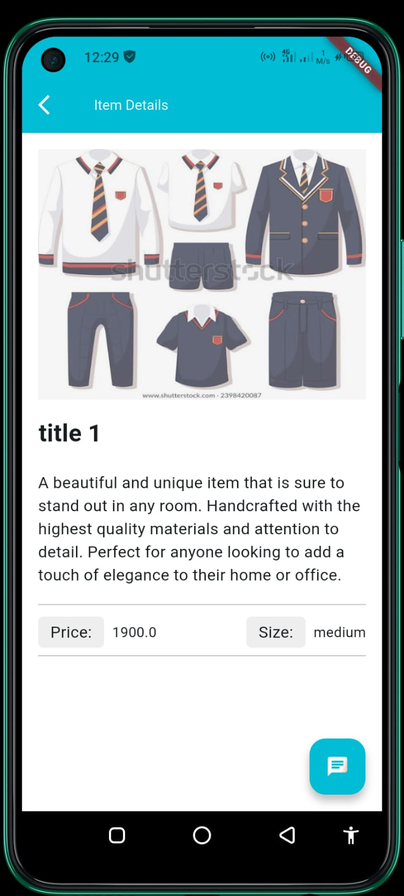
   
  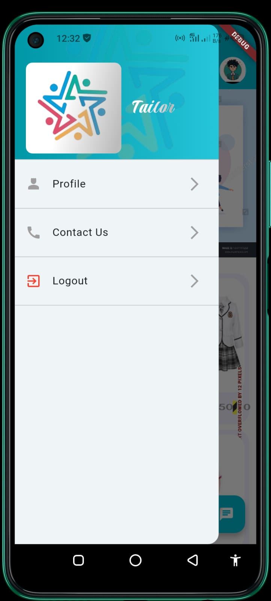
  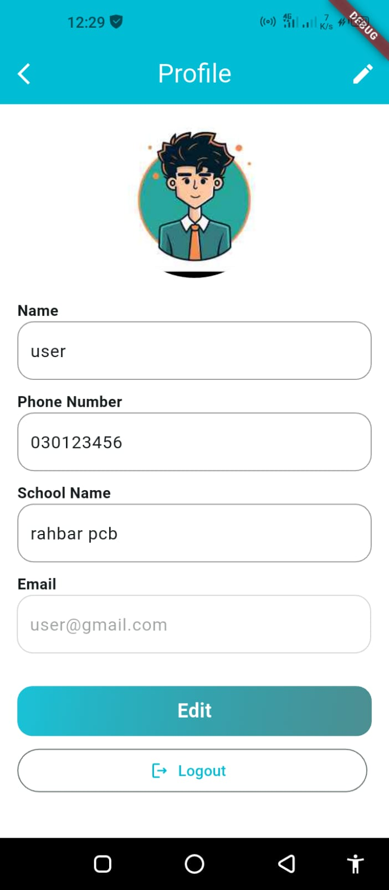
  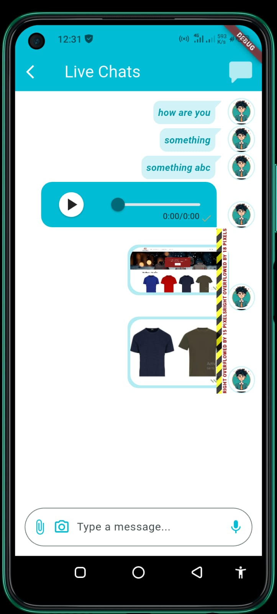
  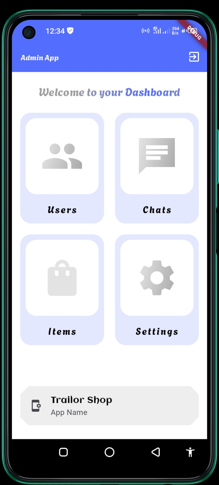
  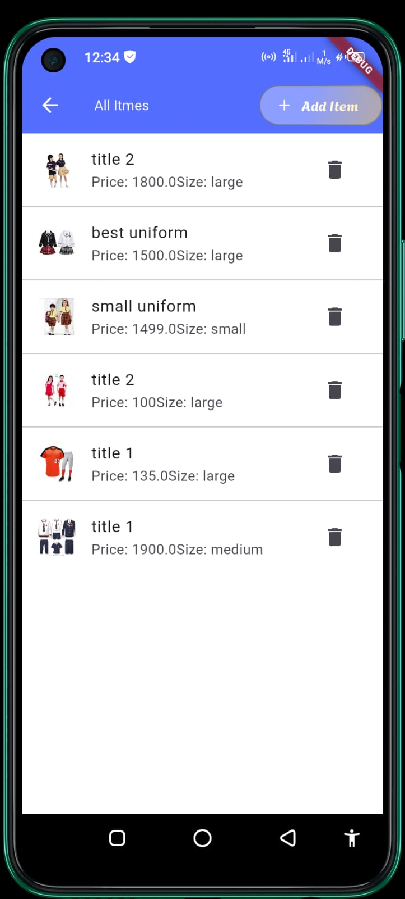
  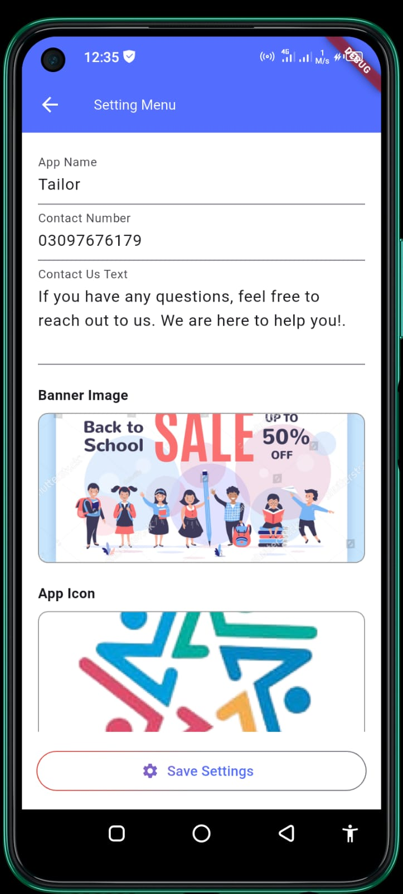
  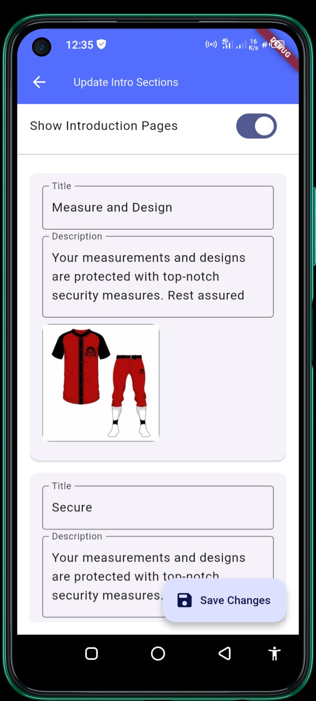

## Getting Started

This project is a starting point for a Flutter application that follows the
[simple app state management
tutorial](https://flutter.dev/to/state-management-sample).

For help getting started with Flutter development, view the
[online documentation](https://docs.flutter.dev), which offers tutorials,
samples, guidance on mobile development, and a full API reference.

## Assets

The `assets` directory houses images, fonts, and any other files you want to
include with your application.

The `assets/images` directory contains [resolution-aware
images](https://flutter.dev/to/resolution-aware-images).

## Localization

This project generates localized messages based on arb files found in
the `lib/src/localization` directory.

To support additional languages, please visit the tutorial on
[Internationalizing Flutter apps](https://flutter.dev/to/internationalization).
